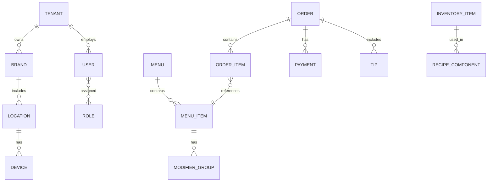

# Multi-Restaurant POS SaaS – Full Requirements (Refactor v1)

Document version: 1.0 (Refactor v1)
Date: August 8, 2025
Author: Product Owner (30+ years multi-location restaurant operations)

References (inputs)
- docs/planning_2.md
- docs/screens/pos_terminal.md
- docs/screens/inventory_wireframes.md
- docs/screens/wireframe_menu_management.md
- docs/screens/wireframe_modifier_management.md
- docs/screens/wireframe_category_group_management.md
- docs/screens/wireframe_employee_user_management_final.md
- docs/screens/wireframe_main_dashboard_final.md
- docs/screens/wireframe_reporting_bi_full_screens_no_export.md
- docs/screens/wireframe.md, docs/screens/wireframe-1.excalidraw

Assumptions
- UX patterns aligned to Toast POS and Square POS for discoverability and training efficiency.
- Cloud-first with POS offline-first capabilities.
- Payments via EMV-certified terminals through supported gateways; no card data touches application servers (point-to-point encryption/tokenization).


## 1) Executive summary and goals

Build an enterprise-grade, multi-tenant POS SaaS for restaurants (single and multi-location, franchises, virtual brands). It must be reliable in high-volume service, offline-capable, secure, and fast. Corporate management requires centralized control with location-level flexibility, comprehensive reporting/BI, and an open developer platform.

Goals
- Service excellence: sub-second UI, <1s KDS/print, resilient offline.
- Central control: master menus, pricing, taxes, branding with local overrides.
- Financial accuracy: audit-ready, PCI DSS aligned, deterministic cash and tips.
- Developer ecosystem: stable APIs/webhooks, versioned, auditable.
- Accessibility and global readiness: WCAG AA, time zones, currencies, tax models.

Success criteria
- p95 POS action latency ≤ 150 ms. Ticket fire to KDS/print ≤ 1s p95.
- 99.95% monthly availability (core platform), POS continues offline ≥ 8 hours.
- No critical P1 security findings in external annual pentest.
- UAT across 4 service modes with pass rate ≥ 95% on smoke/regression.


## 2) Business KPIs and measurable outcomes

- Sales uplift: +5–10% AOV via upsells, combos, loyalty.
- Labor efficiency: −10% minutes per order; labor % vs sales down 2–4 pts.
- Order accuracy: comps/voids due to operator error < 0.5% of sales.
- Speed of service: QSR order ready p95 ≤ 7 min; full-service fire-to-first-course p95 ≤ 12 min.
- Inventory variance: theoretical vs actual variance ≤ 3% monthly.
- Uptime: 99.95% core; < 30 min RTO, < 5 min RPO for critical data.


## 3) Scope and out-of-scope

In scope
- POS operations (dine-in, takeout, delivery, curbside), table/floor, KDS/printing.
- Menus, pricing, discounts, taxes/fees, payments, tips.
- Inventory/purchasing, employee time/attendance, RBAC.
- Reporting/BI, device management, admin/config.
- Online ordering, aggregator ingest, loyalty/gift, CRM.
- APIs/webhooks, audit trails, observability, multi-tenant isolation.

Out of scope (initial release)
- Native driver app (use SMS links and web dispatch first).
- In-house accounting ledger (integrate with QuickBooks/Xero instead).
- Payroll processing (export to providers).
- Complex table reservation marketplace integrations (basic waitlist/reservations included; 3rd-party deep integrations deferred).


## 4) Personas and roles

Personas
- Owner/Corporate Admin: brand-wide control, financials, policies.
- General Manager: location operations, reports, staff, cash, printer maps.
- Shift Manager: tills, discounts approval, voids/refunds, staff breaks.
- Server/Cashier/Bartender: order, pay, tip, close, basic reprints.
- Kitchen/Expo: view/finalize tickets, bump items/courses.
- Inventory Manager: vendors, POs, receiving, counts, wastage.
- Accountant: exports, period close, taxes, audits.
- Customer: online ordering, loyalty, receipts.

RBAC note: All capabilities are permission-gated; roles are templates.


## 5) Tenant model: franchises, brands, locations, device-user mapping

- Tenant (Org): logical isolation boundary; owns billing and legal.
- Brand: marketing concept; may share or segment menus.
- Location: physical store with tax, hours, devices, printers.
- Device: POS/KDS/printer/terminal registered to a location, scoped by device keys.
- User: can belong to tenant with role bindings at tenant/brand/location scope.
- Data isolation: row-level by tenant_id; brand_id and location_id derive.

Mermaid ER (high-level)



## 6) End-to-end workflows

Service modes
- Dine-in: seat → order by course → fire → serve → pay/tip → close.
- Takeout: quote time → fire → pack → pay at order or pickup → deliver.
- Delivery: zone/fee → driver assign → track → delivered → tip settle.
- Curbside: stall assignment → arrival notify → car handoff → close.

Table/floor & reservations/waitlist
- Digital floor plan with areas; reservations with party size/time; waitlist with SMS.
- Table actions: split/merge/transfer, combine checks, move items.

Order lifecycle
- States: Open → Fired → In-Progress → Ready/Expo → Served/Picked → Paid → Closed. Exceptions: Void, Refund, Comp, Re-open.

```mermaid
flowchart LR
  A(Open) -->|Fire| B(Kitchen)
  B --> C(Expo Ready)
  C --> D(Served/Picked)
  D --> E(Pay)
  E --> F(Close)
  A -.> X(Void)
  F -.> Y(Refund)
```

Kitchen routing
- Route by item/station; consolidate courses; ticket timers; expo screen.

Cash management
- Till open/assign, blind close, cash drops, safe count, end-of-day reconciliation.

Acceptance (workflow excerpts)
- Given dine-in table with 4 guests, when server fires appetizers then mains with 8-min stagger, then KDS must show course grouping and timers per station; p95 signal to KDS < 1s.
- Given split check by seats, when items are moved between checks, taxes/fees recalc per check and payment splits must validate exact totals.


## 7) Feature set (specs, edge cases, acceptance)

Guiding template per feature
- UI: key screens/components.
- Workflow: steps and roles.
- Rules: validations and business constraints.
- Edge cases: unusual or failure scenarios.
- Mobile/tablet: responsive notes.
- Acceptance: Given/When/Then.

### 7.1 Menu & catalog
UI
- Screens: Category/Item list, Item editor, Modifier group editor, Recipe tab.
- Bulk ops: import/export CSV; multi-location push.

Workflow
- Create category → item with sizes/variants → attach modifier groups (forced/optional) → set tax class, print/KDS route → publish.

Rules
- Modifiers: min/max selection; price deltas; nested groups allowed (depth 2); size-conditional.
- Allergens: per item; require warning at order if allergen present and customer profile flags.
- Recipes: per serving yields; deplete inventory at fire or close (configurable).

Edge cases
- Out-of-stock: hide or show-not-available behavior per location.
- Location override: price or availability differs; inherit unless overridden.

Mobile/tablet
- Two-pane layout on tablets; modal editor on phones; large touch targets (min 44x44pt).

Acceptance
- Given forced modifier group min=1 max=2, when cashier adds item and selects 0 modifiers, then Add to cart is disabled with inline message.
- Given location override price, when corporate pushes menu update without price change, then local price remains.

### 7.2 Pricing
Rules
- Time/daypart rules; happy hour windows; tax inclusive/exclusive per location.
- Service fees: flat/percent, by channel (dine-in, online, delivery); taxable flags.
- Rounding: cash rounding by currency; line vs order-level rounding.

Edge cases
- Overlapping rules: highest specificity wins (location > brand > tenant); tie-break by latest effective date.

Acceptance
- Given happy hour 4–6pm -20% on category Drinks, when order at 17:30 contains Beer, then Beer line shows discounted price and receipt displays discount reason.

### 7.3 Discounts & promos
Rules
- Codes and auto-rules; eligibility by role, channel, item/category, cart total.
- Stacking: priority ordered; exclusive flags; per-item vs order-level.
- Reasons: required for comps/voids; reason dictionary manageable.

Edge cases
- Max discount exposure per employee per shift.

Acceptance
- Given order-level 10% and item-level $2 off, when both apply, then system applies higher priority first and ensures price never below floor price.

### 7.4 Payments
UI
- Tender screen: split by amount/items/guests; tip prompts; signature capture as required by region.

Rules
- EMV flows: online/offline auth; partial approvals; fallback to magstripe where permitted.
- Surcharges: configurable, card-brand compliant; receipt disclosure.
- Offline mode: store encrypted tokens with ceiling per device; force tip adjust on reconnect.

Edge cases
- Partial auth with split remainder to second card or cash.
- Reversals on tip-adjust failure.

Acceptance
- Given offline mode with token budget $300, when card payment $250 is taken, then remaining budget becomes $50 and order stays Pending Settlement until gateway confirms.

### 7.5 Tips & gratuity
Rules
- Suggested tip: 15/18/20% default with custom; configurable.
- Auto-gratuity: party size threshold; tax-before/after gratuity configuration.
- Tip pooling: point-based per role or hours, exportable.

Acceptance
- Given party size 8 and auto-gratuity 18%, when check is closed, then gratuity line appears with correct calculation and is reported in daily tip summary.

### 7.6 Customer & CRM
Features
- Profiles with consent flags (GDPR/CCPA), preferences, allergen notes.
- Visit history across locations (tenant-scoped), opt-in marketing.

Acceptance
- Given customer opts out of marketing, when export to ESP runs, then record is excluded and audit logs capture exclusion reason.

### 7.7 Loyalty & gift cards
Rules
- Points earn on pre-tax (configurable); tiers; birthday bonuses; accrual/expiration.
- Gift cards: issuance, balance, redemption, breakage reporting.

Acceptance
- Given gift card with $25 balance, when applied to $30 check, then remaining $5 due and receipt shows remaining balance $0.

### 7.8 Online ordering
Features
- Menu sync with availability and throttle; pickup/delivery windows; capacity by interval; curbside stall.

Acceptance
- Given capacity 20 orders per 15 min, when the 21st order is attempted for 12:00, then next available slot is offered.

### 7.9 Aggregators (DoorDash/UberEats/Grubhub)
Model
- Poll/push orders into a unified queue; map menu; reconcile commissions and taxes.

Acceptance
- Given item is 86’d locally, when aggregator order includes it, then order is rejected with replacement suggestions if configured.

### 7.10 Inventory
Features
- Ingredients, recipes, depletion at fire/close; vendors, POs, receiving, transfers; wastage; counts (blind/partial), par levels; COGS.

Edge cases
- Unit conversions (case→each); yield and trim loss.

Acceptance
- Given recipe uses 0.2 lb chicken, when 10 orders are fired, then on-hand reduces by 2 lb ± tolerance, and low-stock alert triggers if below par.

### 7.11 Employee (RBAC, scheduling, time clock)
Features
- Users, roles, PIN login; time clock with breaks; photo-at-clock, geofence.

Acceptance
- Given user lacks Refund permission, when attempting refund, then UI hides control and API returns 403 with audit log entry.

### 7.12 Reporting & BI
Features
- Sales mix, item-level, discounts/voids, tips, labor, inventory/COGS, taxes, device health, shift reports. Export CSV/Excel/PDF.

Acceptance
- Given close-of-day, when Z-report is generated, then totals reconcile to payments and cash variance is computed with over/short thresholds.

### 7.13 Devices/hardware
Features
- Register tablets, printers, KDS, scanners, scales, terminals; pairing via QR; keepalive; status/diagnostics.

Acceptance
- Given kitchen printer offline, when firing ticket, then route to backup device per printer map and notify expo tablet.

### 7.14 Admin/config
Features
- Taxes, service charges, hours/holidays, printer maps, KDS screens, payment settings, legal texts, branding/theme.

Acceptance
- Given holiday hours override, when online ordering availability is computed, then closed slots are blocked with explanatory message.

### 7.15 Developer platform
Features
- OAuth2/OIDC, API keys, roles/scopes, rate limits, audit, versioning (v1/v2), sandbox.

Acceptance
- Given webhook retry policy with exponential backoff (max 24h), when endpoint returns 500, then deliveries retry with signed payloads and dedupe-id.


## 8) Screen inventory and specs

Note: Align visual structure with docs/screens/* wireframes.

Core screens (per screen include: purpose, primary actions, states, validations, empty/edge/error, accessibility)
- POS Home / Floor Plan: seat, table status, filters; states: free, seated, fired, check ready; error: printer offline banners; a11y: high contrast, large buttons.
- Order Screen: item grid, modifiers, cart, discounts, notes; validation: forced modifiers; states: out-of-stock; mobile: bottom sheet cart.
- Payments: tender types, split, tip prompts; validation: totals match; error: partial auth.
- KDS: ticket lanes per station, timers, bump; states: rush/held; error: device offline.
- Menu Management: list/detail editors; validations for min/max modifiers; bulk price edits.
- Inventory: item list, recipes, POs, receiving; validations: unit conversions.
- Employees: users, roles, time clock admin.
- Reports Dashboard: filters, date ranges, export; empty: no data hints.
- Settings: taxes, fees, hours, devices, printer maps.
- Online Ordering Config: capacity, menus, hours, blackout.

Each screen must include
- Keyboard nav order; labels/aria; focus states; error summaries; min target 44pt; color contrast ≥ 4.5:1; tablet landscape/portrait specs; phone stacked layout.


## 9) Data model

Key entities (selected fields)
- tenant(id, name, billing_account_id, created_at)
- brand(id, tenant_id, name)
- location(id, brand_id, name, tz, currency, tax_region, hours_json)
- device(id, location_id, type, status, last_seen)
- user(id, tenant_id, email, status, mfa_enabled)
- role(id, tenant_id, name); user_role(user_id, scope{tenant|brand|location}, scope_id, role_id)
- category(id, tenant_id, name, sort)
- menu_item(id, tenant_id, category_id, name, sku, tax_class, price_json, flags)
- modifier_group(id, item_id|null, name, min, max)
- modifier_option(id, group_id, name, price_delta)
- order(id, location_id, table_id|null, channel, status, subtotal, tax, fees, total, currency)
- order_item(id, order_id, menu_item_id, name, qty, unit_price, modifiers_json, tax)
- payment(id, order_id, type, amount, currency, status, processor_ref, offline_token_id|null)
- tip(id, order_id, amount, type, distribution_json)
- inventory_item(id, tenant_id, sku, uom, par_level, on_hand)
- recipe_component(id, menu_item_id, inventory_item_id, qty, uom, yield)
- vendor(id, tenant_id, name, terms); purchase_order(id, vendor_id, status, totals)
- receiving(id, po_id, items_json, variance_json)
- audit_log(id, actor_id, scope, action, resource, before, after, ip, at)
- webhook_subscription(id, tenant_id, event, url, secret, status)

Indexes
- All FKs; order(status, location_id, created_at); payment(order_id, status); audit_log(scope, resource, at DESC); inventory_item(tenant_id, sku UNIQUE);
- Partition large tables by tenant_id then time (orders, audit_log).

Multi-tenant boundaries
- tenant_id on all business rows. Strict RLS (Row Level Security) at DB and service layers.


## 10) APIs and integration contracts

API style
- REST JSON (v1) with HAL-like links; GraphQL read model optional for BI.
- Idempotency-Key header for POST/PUT that create side effects.
- Pagination: cursor-based (limit, cursor) with stable sort.
- Error format: { code, message, details[], traceId }.

Representative endpoints (REST v1)
- Auth: POST /oauth/token, GET /me
- Tenancy: GET /tenants/{id}, GET /brands, GET /locations
- Menu: GET/POST /menu/items, GET/POST /menu/modifier-groups, POST /menu/publish
- Inventory: GET/POST /inventory/items, /recipes, /vendors, /purchase-orders, /receivings
- Orders: POST /orders, GET /orders/{id}, POST /orders/{id}/items, POST /orders/{id}/fire, POST /orders/{id}/close
- Payments: POST /orders/{id}/payments, POST /payments/{id}/capture, POST /payments/{id}/refund
- Discounts: GET/POST /discounts, POST /orders/{id}/discounts
- Loyalty: GET /customers/{id}/loyalty, POST /loyalty/redeem
- Employees: GET/POST /users, /roles, POST /time-clock/clock-in
- Reports: GET /reports/sales, /reports/items, /reports/tips (async export supported)
- Devices: GET/POST /devices, POST /devices/{id}/pair
- Settings: GET/PUT /locations/{id}/settings

Request/response schemas
- Use UUIDs; monetary fields as integers in minor units; timestamps ISO 8601 with tz; enums for status.

Webhooks
- Events: order.created/updated/closed, payment.authorized/captured/refunded, inventory.low, menu.published, employee.clocked_in/out.
- Delivery: POST with HMAC-SHA256 signature (X-Signature), X-Event-Id (UUID), X-Retry-Count.
- Retries: exponential backoff (e.g., 1m, 5m, 15m, 1h, 6h, 24h), max 24h.

Security
- OAuth2 (client credentials for service, auth code + PKCE for user). Scopes map to RBAC permissions.

Idempotency
- Idempotency-Key dedupes by method+path+tenant+body hash; store for 24h.


## 11) Non-functional requirements

Security
- PCI DSS scope minimized by P2PE; no PAN storage; tokenization; TLS 1.2+; at-rest AES-256. Least privilege; quarterly access reviews; audit trails immutable.
- SSO/SAML/OIDC for corporate. MFA optional/required per policy. Secrets in HSM/managed KMS.

Compliance
- GDPR/CCPA: consent, DSAR export/delete within 30 days, data minimization, regional data residency if required.

Performance
- p95 latencies: POS UI action ≤ 150 ms; search/list ≤ 300 ms; KDS/print dispatch ≤ 1s.
- Throughput: support 200 orders/min per location burst; horizontally scalable.

Availability
- SLO: 99.95% monthly core; DR: RTO ≤ 30 min, RPO ≤ 5 min; multi-AZ; optional multi-region active-active for POS sync topics.

Offline-first POS
- Local write-ahead queue; conflict resolution last-writer-wins with vector clock on orders; human reconciliation UI for collisions.

Observability
- Logs with tenant and request IDs; RED metrics; distributed tracing; anomaly alerts.

Scalability & cost
- Per-tenant quotas; backpressure; autoscaling; storage lifecycle policies.

Accessibility
- WCAG 2.1 AA; keyboard-only flows; color contrast; large touch targets.

Localization
- Time zones per location; currency per tenant/location; number/date formats; tax-inclusive regions supported.


## 12) Operational playbooks

Deployments
- Blue/green with feature flags; canary by tenant/region; DB migrations backward compatible (expand→migrate→contract).

Incidents
- On-call rotations; severity matrix; runbooks for: payment outages, printer/KDS incidents, sync backlog, data drift.

Support
- Tiers 1–3; SLAs: P1 within 15 min; status page; RCA within 5 business days.

Data
- Backups daily + PITR; restore drills quarterly; key rotation semi-annual.


## 13) Test strategy and acceptance

BDD
- Gherkin scenarios per feature; smoke pack for core POS flows; regression for menu/pricing, payments, KDS, inventory, RBAC.

Performance
- Load: 10x lunch rush; goal: p95s within targets; KDS dispatch under 1s.

Hardware-in-the-loop
- EMV terminals, printers (esc/pos), KDS tablets in CI lab with simulators where possible.

UAT checklist (excerpt)
- Create menu with forced/optional modifiers; place dine-in and takeout orders; split/merge checks; apply discounts; process EMV; offline sale and settle; print and KDS; inventory depletion; clock in/out; reports reconciliation.

Sign-off
- All P1/P2 defects closed; variances < tolerance; security tests passed.


## 14) Assumptions, dependencies, open questions

Assumptions
- Aggregator integrations via vendor-provided APIs/webhooks.
- Payment processors support tip adjust and partial capture.

Dependencies
- EMV device SDKs; printer/KDS vendor SDKs; cloud queue (e.g., Kafka) for sync; object storage for exports.

Open questions
- Which tax engine for complex jurisdictions? Built-in vs external (e.g., Avalara).
- Gift card provider: in-house vs third-party tokens.
- Loyalty: points-only MVP or tiers at launch?


## 15) Traceability matrix (excerpt)

| ID | Requirement | Screens | APIs | Tests |
|---|---|---|---|---|
| R-ORD-001 | Order open→fire→close within targets | POS Order, KDS, Payments | POST /orders, /orders/{id}/fire, /orders/{id}/close | BDD: order lifecycle; perf: dispatch <1s |
| R-MNU-010 | Forced/optional modifiers with min/max | Menu Mgmt, POS Order | /menu/items, /menu/modifier-groups | Gherkin: min/max validation |
| R-PAY-020 | Split payments incl. partial auth | Payments | /orders/{id}/payments, /payments/{id}/capture | EMV simulator: partial auth flow |
| R-INV-030 | Recipe depletion at fire | Inventory, KDS | /orders/{id}/fire | Depletion calc test |
| R-RBAC-040 | Role-based 403 enforcement | All | Auth + scopes | Access matrix tests |
| R-REP-050 | Z-report reconciles | Reports | /reports/sales | Golden dataset reconciliation |
| R-API-060 | Idempotent creates | All | Idempotency-Key | Duplicate submit tests |
| R-WBH-070 | Webhook retry/backoff | N/A | Webhooks | Retry/e2e signature tests |


Notes
- See docs/screens/* for UI layouts; this document supplies behavior, rules, and acceptance. Expand each module with detailed field tables as implementation proceeds.

---

End of document.
